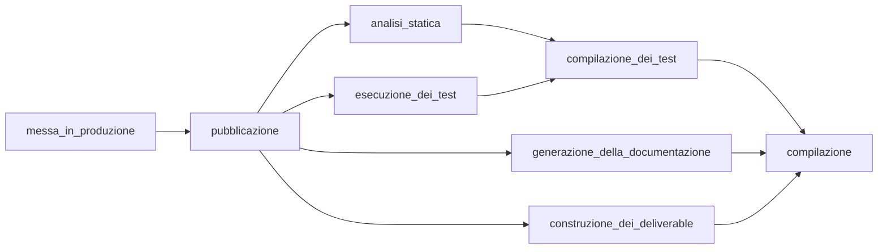
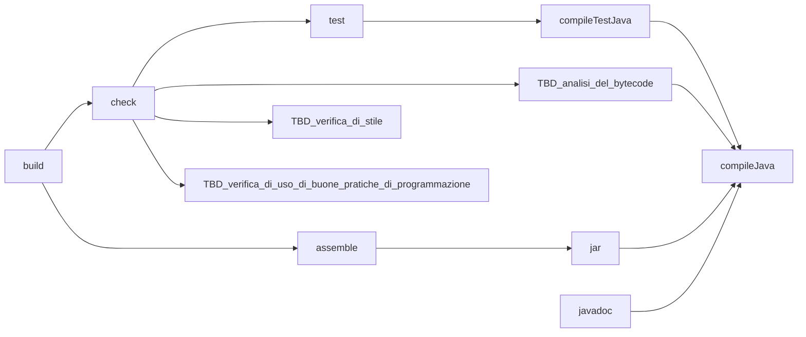

# Laboratorio 7: Documentazione del codice e costruzione degli artefatti

| [Laboratorio 7](./README.md) | [Esercizio 1 >>](./71-custom-iterable/README.md) |

Oggi parliamo delle operazioni di verifica all’interno del processo di costruzione del software, un’attività fondamentale per garantire che ogni componente sia solido e funzioni come previsto. Per farlo, sfruttiamo un *build system*, ossia un sistema automatico che ci aiuta a gestire ogni fase della costruzione, dalla compilazione dei sorgenti fino alla creazione degli artefatti finali pronti per la distribuzione.

## 7.1 Test e Build Lifecycle

Il ciclo di vita del build e dei test è una sequenza predefinita di operazioni che il nostro sistema di build esegue automaticamente. In particolare, la verifica del software non è solo il risultato finale, ma è distribuita attraverso vari passaggi. Questi includono:

1. **Compilazione.** Questa fase la conosciamo già bene. Si tratta di trasformare il codice sorgente in bytecode o in un eseguibile, in modo che possa essere eseguito dalla macchina.
2. **Compilazione dei test.** La compilazione dei test è simile alla compilazione del codice principale, ma invece di produrre un'applicazione, crea un set di istruzioni specifiche per eseguire test su singole unità o componenti del software. Ciò garantisce che i nostri test siano pronti a essere eseguiti.
3. **Verifica statica della qualità dei sorgenti.** Questo lo vedremo nei prossimi laboratori, ma in sintesi, la verifica statica analizza il codice senza eseguirlo, per individuare problemi di stile, errori logici evidenti o difetti di progettazione. Questo passaggio è importante per mantenere una qualità alta e standardizzata.
4. **Esecuzione dei test.** Questo lo vedremo oggi. Una volta compilati, i test vengono eseguiti. Possono includere test unitari, test di integrazione, e test funzionali. L’obiettivo è confermare che le singole parti funzionino e che funzionino anche insieme.
5. **Generazione della documentazione.** Anche questo passaggio lo trattiamo oggi. La documentazione è fondamentale non solo per noi, ma anche per chi utilizzerà o modificherà il software in futuro. Un build system può generarla automaticamente da commenti strutturati nel codice, come i Javadoc in Java.
6. **Costruzione degli artefatti “deliverable”.** Oggi ci concentreremo anche su questo. Alla fine del processo di build, il sistema genera artefatti, cioè pacchetti o eseguibili che possono essere distribuiti e utilizzati. Questi sono i "prodotti" del nostro codice.
7. **Pubblicazione.** Questo sarà trattato probabilmente in corsi magistrali. La pubblicazione prevede che gli artefatti siano caricati in un sistema di distribuzione, rendendoli disponibili ad altri, ad esempio in un repository pubblico o in un sistema di distribuzione interno.
8. **Messa in produzione.** Un altro passaggio avanzato. È l’ultima fase, in cui l’artefatto viene distribuito in un ambiente di produzione, dove l’applicazione è usata dagli utenti finali.



## 7.2 Gradle e il Mapping dei Task

In Gradle, ogni fase del processo di costruzione è rappresentata da un task. Un task è un’unità di lavoro, come la compilazione del codice, l’esecuzione dei test o la creazione degli artefatti. Il vantaggio principale di Gradle è che i task sono collegati tra loro, creando una sequenza ordinata in cui ogni task necessario viene eseguito automaticamente prima di quello richiesto.

### 7.2.1 Esecuzione di un Task e i suoi Predecessori

Quando eseguiamo un task in Gradle, tutti i task dai quali dipende vengono eseguiti automaticamente. Questo vuol dire che chiedere di eseguire, ad esempio, `test` implicherà anche la compilazione di tutto il codice necessario per eseguire quei test.

---

### 7.2.2 Principali Task di Gradle

Vediamo in dettaglio i task principali del build lifecycle di Gradle:

1. Il `task` test esegue tutti i test del progetto. Questo implica l’esecuzione di `compileTestJava`, che a sua volta implica `compileJava`. Quindi, prima di eseguire i test, Gradle compila sia il codice sorgente dell’applicazione che il codice dei test.
2. Il task `check` esegue `test` e altri controlli di qualità che vedremo più avanti, come le verifiche statiche o altri test di integrazione.
Poiché `check` dipende da `test`, eseguendo `check`, Gradle eseguirà anche tutti i test.
3. Il task `assemble` costruisce gli artefatti finali, detti anche “deliverable”. Esegue il task `jar`, che dipende da `compileJava`, garantendo che tutto il codice sia compilato prima di creare gli artefatti.
4. Il task `build` è un task principale che racchiude l’intero ciclo di vita del build. Esegue sia `check` che `assemble`, quindi copre tutte le fasi:
    1. verifica del codice,
    2. esecuzione dei test,
    3. generazione degli artefatti.

---

### 7.2.3 Esecuzione dell’intero ciclo di vita

Un modo completo per avviare tutto il processo è il comando:

```bash
./gradlew build javadoc
```

Questo comando esegue:

1. `build`, che include `check` e `assemble`, garantendo che tutti i test e le compilazioni necessarie siano eseguiti e che gli artefatti finali vengano generati.
2. `javadoc`, per generare la documentazione del codice in formato JavaDoc.



## 7.3 Separazione fra Sorgenti Principali e Sorgenti di Test

Gradle adotta una struttura organizzata per separare in modo chiaro i sorgenti principali del software dai sorgenti di test. Vediamo nel dettaglio perché questa separazione è importante e come Gradle la implementa.

### 7.3.1 Cartelle Dedicate

Gradle utilizza due cartelle principali per distinguere questi due tipi di sorgenti:

1. **Sorgenti del software: ``src/main``** - Qui troviamo tutto il codice dell’applicazione, cioè il cuore del nostro programma. Quando Gradle compila e costruisce il “deliverable”, include solo i sorgenti che si trovano in questa cartella, garantendo che il codice compilato sia esclusivamente quello destinato alla distribuzione.
2. **Sorgenti di test: `src/test`** - Questa cartella contiene il codice di test. Anche se il codice di test è parte integrante del progetto, serve solo per validare e verificare la correttezza dell’applicazione durante il processo di sviluppo. Non vogliamo che questi test siano inclusi nel deliverable finale, perché non sono destinati all’utente finale.

---

### 7.3.2 Vantaggi di questa Separazione

1. **Ottimizzazione del Deliverable.** Quando costruiamo l’artefatto finale, non vogliamo includere test o dipendenze specifiche ai test, come le librerie per il testing (JUnit, Mockito, ecc.). Queste dipendenze servono solo a eseguire verifiche interne e non aggiungono nulla al prodotto finale.
2. **Manutenibilità e Pulizia del Progetto.** Avere una struttura chiara aiuta a mantenere il progetto ordinato, riducendo la possibilità di errori e facilitando il lavoro di chiunque debba collaborare al codice. Sapendo che i sorgenti si trovano sempre in `src/main` e i test in `src/test`, risulta più facile trovare e gestire il codice.
3. **Integrazione dei Sorgenti di Test.** Anche se non fanno parte del deliverable, i test sono cruciali durante lo sviluppo e devono essere inclusi nel progetto, eseguibili ogni volta che vogliamo verificare il funzionamento del codice. La struttura di Gradle permette di compilare ed eseguire i test automaticamente quando richiesto, senza mai includerli nella fase di costruzione finale.

## 7.4 Configurazione di JUnit 5 in Gradle

Per configurare JUnit 5 in Gradle e poter eseguire i test, dobbiamo seguire alcuni passaggi per indicare a Gradle quali librerie includere e come gestire i test. Vediamoli uno per uno.

### 7.4.1 Configurazione di JUnit nel build file di Gradle

Il plugin Java in Gradle, di base, non configura alcuna suite di test specifica. Quindi, dobbiamo indicare nel nostro file di build dove reperire le librerie di JUnit e quali moduli usare. Per questo seguiamo questi passi:

- Indicare il repository **Maven Central** per il download delle librerie JUnit.
- Specificare i moduli di *JUnit* che vogliamo usare, come `junit-jupiter-api` e `junit-jupiter-params`, insieme alla versione desiderata.
- Abilitare *JUnit Platform*, la piattaforma di avvio dei test per *JUnit 5*, necessaria per eseguire i test.
- Abilitare il logging dettagliato (opzionale), per ottenere più informazioni sull’esecuzione dei test.

---

### 7.4.2 Dove Trovare le Librerie *JUnit*?

In Gradle, specifichiamo dove prendere le librerie con la sezione repositories. Questa configurazione va inserita nel file `build.gradle`:

```groovy
repositories {
    mavenCentral()
}
```

Questa configurazione dice a Gradle di cercare le dipendenze su Maven Central, il repository più comune per le librerie Java.

---

### 7.4.3 Selezionare Moduli e Versioni di JUnit

Nella sezione `dependencies` del file `build.gradle`, specifichiamo:

- `testImplementation` per indicare che le librerie JUnit sono usate solo nei test e non incluse nel deliverable.
- `testRuntimeOnly` per indicare che il motore di esecuzione (`junit-jupiter-engine`) serve solo a runtime, cioè durante l'esecuzione dei test.

Ecco un esempio di configurazione delle dipendenze per JUnit 5:

```groovy
dependencies {
    val junitVersion = "5.9.1"
    testImplementation("org.junit.jupiter:junit-jupiter-api:$junitVersion")
    testImplementation("org.junit.jupiter:junit-jupiter-params:$junitVersion")
    testRuntimeOnly("org.junit.jupiter:junit-jupiter-engine:$junitVersion")
}
```

- `junit-jupiter-api`: contiene l’API principale per scrivere i test.
- `junit-jupiter-params`: aggiunge supporto per i test parametrizzati.
- `junit-jupiter-engine`: il motore che esegue effettivamente i test; è richiesto solo a runtime.

---

### 7.4.4 Usare JUnit Platform

Per configurare il task di test a usare *JUnit Platform*, aggiungiamo il seguente blocco nel nostro file di `build.gradle`:

```groovy
tasks.test {
    useJUnitPlatform()
}
```

Questo comando dice a Gradle di utilizzare la piattaforma JUnit 5 per l’esecuzione dei test.

---

### 7.4.5 Abilitare Maggiori Informazioni sull’Esecuzione dei Test (opzionale)

Possiamo configurare Gradle per mostrare dettagli su ogni evento di test (inizio, fine, risultato, output). Questo aiuta a ottenere un feedback immediato e dettagliato sullo stato dei test:

```groovy
tasks.test {
    testLogging { events(TestLogEvent.values()) }
    testLogging.showStandardStreams = true
}
```

---

### 7.4.6 Build File Completo

Ecco come appare un esempio completo del file `build.gradle.kts` con tutte le configurazioni di cui abbiamo parlato:

```groovy
plugins {
    java
}

repositories {
    mavenCentral()
}

dependencies {
    val junitVersion = "5.9.1"
    testImplementation("org.junit.jupiter:junit-jupiter-api:$junitVersion")
    testImplementation("org.junit.jupiter:junit-jupiter-params:$junitVersion")
    testRuntimeOnly("org.junit.jupiter:junit-jupiter-engine:$junitVersion")
}

tasks.test {
    useJUnitPlatform()
    testLogging { events(TestLogEvent.values()) }
    testLogging.showStandardStreams = true
}
```

Ora, con questa configurazione, Gradle è pronto a lanciare i test usando JUnit 5 tramite il comando:

```bash
./gradlew test
```

## 7.5 Assemblaggio di applicazioni Java

Quando distribuiamo un’applicazione Java, vogliamo che sia facile da usare e da condividere, racchiudendo tutto il necessario in un unico file. Per questo, si utilizza il packaging delle applicazioni, comunemente in un file **JAR (Java Archive).**

### 7.5.1 Cos’è un file JAR?

Un JAR (Java ARchive) è un archivio ZIP che contiene:

1. Le **classi** compilate dell’applicazione
2. **Risorse aggiuntive** (es. icone, file di configurazione)
3. Un file `Manifest`, che descrive l’applicazione e può includere informazioni su:
    - Quale classe contiene il `main` per eseguire l’applicazione.

Questa struttura consente di distribuire il software come un singolo file e, se configurato correttamente, possiamo eseguire l’applicazione semplicemente facendo doppio clic sul file `.jar`, oppure utilizzarlo come libreria in altri progetti Java.

---

### 7.5.2 Creare un file JAR

Per creare un file JAR possiamo utilizzare:

1. Build automation tool come Gradle o Maven (che sono preferiti in progetti più complessi).
2. Il comando `jar` direttamente dal terminale, utile per progetti più semplici o quando si vuole capire meglio come funziona il packaging.

Il comando `jar` ci permette di creare un JAR direttamente da terminale. Vediamo alcune delle sue opzioni principali:

- `c`: Crea un nuovo file JAR.
- `f`: Specifica il nome del file JAR di output.
- `m`: Permette di specificare un file Manifest personalizzato. Se non è specificato, viene generato un Manifest di default.

**Esempi di utilizzo del comando `jar`**

1. Creare un JAR con un `Manifest` di default.

    ```bash
    jar cf myapp.jar file1 file2 directory1
    ```

    Crea un JAR chiamato `myapp.jar` che include `file1`, `file2` e `directory1`, con un Manifest di default.

2. Creare un JAR contenente tutti i file e le directory nella cartella corrente.

    ```bash
    jar cf myapp.jar *
    ```

    Include tutto nella cartella corrente nel JAR `myapp.jar`, usando sempre un Manifest di default.

3. Creare un JAR con un Manifest personalizzato.

    ```bash
    jar cfm myapp.jar MYMANIFEST it/unibo/*
    ```

    Crea un JAR chiamato `myapp.jar`, includendo i file e le directory in `it/unibo/*`, utilizzando il file `MYMANIFEST` come Manifest. Un Manifest personalizzato è utile per specificare la classe principale da eseguire:

    ```plaintext
    Manifest-Version: 1.0
    Main-Class: com.example.MainClass
    ```

---

### 7.5.3 Esecuzione di JAR file tramite command line

Per eseguire un file JAR dalla command line, possiamo utilizzare l’opzione `-jar` del comando `java`. Questa opzione dice alla JVM di avviare l’applicazione contenuta nel file JAR. Supponiamo di avere un file JAR chiamato ``myapp.jar``. Per eseguirlo, useremo il seguente comando:

```bash
java -jar myapp.jar
```

Cosa fa il comando ``java -jar``? Quando lanciamo il comando ``java -jar``, la JVM:

1. Legge il file Manifest nel JAR (che si trova in `META-INF/MANIFEST.MF`).
2. Cerca l’attributo `Main-Class` nel Manifest. Questo attributo deve specificare la classe contenente il metodo `main` da eseguire.
3. Avvia l’applicazione partendo dalla classe specificata come `Main-Class`.

---

### 7.5.4 Esempio di Manifest per eseguire un file JAR

Per assicurarsi che il file JAR sia eseguibile, il Manifest deve contenere una riga come questa:

```plaintext
Main-Class: com.example.MainClass
```

Dove `com.example.MainClass` è il nome completo (incluso il package) della classe che ha il metodo main.

Errori Comuni:

1. Se il Manifest non contiene `Main-Class`, o se la classe specificata non esiste o non ha un metodo main, l’esecuzione fallirà.
2. Assicurarsi anche di avere tutte le dipendenze necessarie nel classpath, oppure utilizzare Gradle o Maven per creare un JAR “fat” che includa le dipendenze.

## 7.6 Costruzione di file Jar in Gradle

In Gradle, la costruzione di un file JAR può variare a seconda che l'obiettivo sia creare una libreria o un'applicazione eseguibile. Vediamo come si gestiscono i JAR standard e i `fat-jar` (o `uber-jar`) eseguibili, e come possiamo configurare Gradle per gestire diversi scenari.

### 7.6.1 Creazione di un file JAR standard

Gradle, tramite il `plugin Java`, include un task predefinito chiamato `jar`. Questo task crea un file JAR con:

- **Le classi compilate e risorse** presenti in `src/main`.
- Non include i file di test (logicamente non necessari per un'applicazione rilasciata).
- Non include le dipendenze del progetto, né specifica una classe `main` nel Manifest, quindi questo JAR non è eseguibile.

Il task `jar` è pensato soprattutto per creare librerie Java, che altri progetti possono usare come dipendenze.

---

### 7.6.2 Creazione di un Fat-Jar (o Uber-Jar)

Un `fat-jar` include tutto il necessario per eseguire l’applicazione:

- La classe principale (`main`) specificata nel Manifest.
- Tutti i file compilati e risorse da `src/main`.
- Tutte le dipendenze richieste, senza le quali otterremmo errori come `NoClassDefFoundError`.

Poiché il plugin Java non crea direttamente un fat-jar, possiamo usare:

1. Il plugin `application`: integrato in Gradle, configura la classe principale e aggiunge un task `run` per eseguire il progetto.
2. Il plugin `shadow`: un plugin di terze parti che aggiunge il task `shadowJar`, costruendo un JAR con tutte le dipendenze.

### 7.6.3 Esempio di configurazione

Ecco come configurare il `build.gradle` per creare un `fat-jar` con i plugin `application` e `shadow`:

```groovy
plugins {
    java
    application
    id("com.github.johnrengelman.shadow") version "7.0.0"
}

application {
    mainClass.set("your.mainclass.qualified.Name")
}
```

- Per eseguire l’`applicazione`: `./gradlew run` avvierà la classe principale specificata.

- Per creare il `fat-jar`: `./gradlew shadowJar` genererà un file `-all.jar` in `build/libs`, pronto per essere distribuito come eseguibile.

---

### 7.6.4 Configurare multipli `main`

Quando un progetto contiene più classi `main`, è possibile scegliere quale avviare utilizzando le proprietà di progetto. Questo approccio è utile per applicazioni che hanno diverse configurazioni o moduli eseguibili.

Nel `build.gradle.kts`:

```kotlin
val myMainClass: String by project // prende la main class dalle proprietà di progetto
application {
    mainClass.set(myMainClass)
}
```

- Per avviare una specifica classe `main`:

    ```bash
    ./gradlew run -PmyMainClass=it.unibo.oop.Pluto
    ```

    Questo comando avvierà la classe `it.unibo.oop.Pluto` se è presente un metodo `main`.

In sintesi:

1. Il plugin `java` crea JAR standard.
2. Il plugin `application` configura la classe `main`.
3. Il plugin `shadow` consente la creazione di un fat-jar eseguibile con tutte le dipendenze, rendendo il processo di costruzione completo e flessibile.

---

### 7.6.5 Il file `build.gradle.kts` completo

```groovy
plugins {
    java
    application
    id("com.github.johnrengelman.shadow") version "7.0.0"
}

repositories {
    mavenCentral()
}

dependencies {
    val junitVersion = "5.9.1"
    testImplementation("org.junit.jupiter:junit-jupiter-api:$junitVersion")
    testImplementation("org.junit.jupiter:junit-jupiter-params:$junitVersion")
    testRuntimeOnly("org.junit.jupiter:junit-jupiter-engine:$junitVersion")
}

tasks.test {
    useJUnitPlatform()
    testLogging { events(TestLogEvent.values()) }
    testLogging.showStandardStreams = true
}

application {
    mainClass.set("your.mainclass.qualified.Name")
}
```

## 7.7 Documentazione (semi-)automatica

La documentazione del codice sorgente è fondamentale per mantenere il progetto comprensibile e manutenibile. Essa permette di tenere traccia delle motivazioni dietro certe scelte architetturali e implementative. Ad esempio, un nuovo sviluppatore potrebbe trovare difficoltà a capire il funzionamento di un metodo chiamato `doStuff()` senza una documentazione adeguata. La documentazione aiuta a chiarire il ruolo di classi, metodi, parametri e comportamenti, facilitando l'apprendimento per chiunque entri a lavorare su un progetto esistente.

### 7.7.1 `javadoc`

`javadoc` è uno strumento integrato in Java che permette di generare automaticamente la documentazione HTML a partire dai commenti specifici presenti nel codice. Questi commenti devono rispettare una sintassi precisa e trovarsi in posizioni particolari, come l’inizio di una classe o metodo.

Il tool supporta diversi tag specializzati, per fornire informazioni su:

- **Parametri** (`@param`) – descrive ogni parametro di un metodo.
- **Type-parameters** di classi generiche.
- **Valore di ritorno** (`@return`) – descrive il valore restituito da un metodo.
- **Eccezioni** (`@throws`) – indica quali eccezioni potrebbero essere lanciate e in quali condizioni.
- **Deprecazione** (`@deprecated`) – documenta il motivo per cui una classe o metodo è obsoleto e suggerisce alternative.

---

### 7.7.2 Esempio di utilizzo

Ecco un esempio di come appare una documentazione `javadoc`:

```java
import java.util.List;

/**
 * Documentazione esemplificativa di una classe chiamata {@code Something}.
 * È possibile usare <i>tag HTML</i> e caratteri speciali come &amp;, da eseguire come in HTML.
 * È possibile inserire codice in {@code code tags} e collegamenti ipertestuali con {@code @link}, come
 * l'interfaccia {@link List} o il metodo {@link List#of(Object...)}.
 *
 * @param <T> Documentazione per il parametro di classe {@code T}
 * @see List#size()
 * @deprecated Indica che questa classe è deprecata, e fornisce indicazioni sulle alternative.
 */
@Deprecated
interface Something<T> {

    /**
     * Documentazione del metodo.
     * 
     * @param subject Documentazione del parametro {@code subject}
     * @param count Documentazione del parametro {@code count}
     * @return Descrizione del valore di ritorno
     * @throws IOException Spiega le cause dell’eccezione {@code IOException}
     * @throws IllegalArgumentException Documenta eventuali altre eccezioni
     * 
     */
    @Deprecated
    int doIt(List<T> subject, int count) throws IOException { ... }
}
```

---

### 7.7.3 Tag informativi

I principali tag `javadoc` sono:

- `@param` – descrive ogni parametro di input in costruttori e metodi, oppure type-parameters nelle classi generiche.
- `@return` – descrive il valore di ritorno di un metodo.
- `@throws` – documenta le eccezioni che un metodo può lanciare.
- `@see` – link a entità correlate, utile per indicare altre classi o metodi rilevanti.

---

### 7.7.4 Deprecazione in Java

La deprecazione è il processo con cui si segnala che una parte del codice non deve più essere usata, solitamente perché sostituita da una versione migliorata. In Java, le entità deprecate si annotano con `@Deprecated` e vengono documentate tramite il tag `@deprecated`, che suggerisce anche eventuali alternative.

---

### 7.7.5 Tag descrittivi

I tag `{@link ...}` e `{@code ...}` aiutano a formattare il testo in modo leggibile e chiaro:

- **`{@link ...}`** – crea collegamenti ipertestuali a entità interne o esterne.
- **`{@code ...}`** – formatta il testo con un font monospaziato per codice o valori.

---

### 7.7.6 Altri tag

Alcuni tag aggiuntivi sono sconsigliati in questo contesto, come `@since`, `@author` e `@version`, perché le informazioni che forniscono sono generalmente tracciabili tramite un sistema di controllo di versione.

---

### 7.7.7 Linee guida per commentare

- **Commentare interfacce, classi, record**: aggiungere un commento che descriva il ruolo dell’entità.
- **Costruttori e metodi pubblici/protetti**: descrivere i parametri e il valore di ritorno.
- **Override**: evitare commenti ridondanti per metodi override, tranne in caso di peculiarità specifiche, utilizzando `{@inheritDoc}`.

## 7.8 Generazione della Javadoc tramite Gradle

Il comando per generare la Javadoc con Gradle è un processo semplificato grazie all'integrazione del plugin `java`. Quando si utilizza Gradle, è possibile configurare e personalizzare la generazione della documentazione in modo efficace.

### 7.8.1 Passaggi per la generazione della Javadoc

1. **Configurazione del progetto**: Assicurati di avere il plugin `java` nel tuo file `build.gradle`:

   ```groovy
   plugins {
       id 'java'
   }
   ```

2. **Esecuzione del task Javadoc**: Per generare la documentazione, puoi semplicemente eseguire il seguente comando nel terminale:

   ```bash
   ./gradlew javadoc
   ```

   Questo comando crea la documentazione nella directory `build/docs/javadoc`.

3. **Verifica della documentazione**: Dopo aver eseguito il comando, puoi navigare nella cartella `build/docs/javadoc` e aprire il file `index.html` in un browser per visualizzare la documentazione generata. Assicurati di controllare eventuali errori o avvisi emessi durante la generazione, poiché se ci sono commenti incompleti o errati, il task fallirà.

---

### 7.8.2 Personalizzazione della Javadoc

Gradle consente anche di personalizzare diverse opzioni di generazione della Javadoc. Ad esempio, puoi specificare l'author, il titolo della documentazione e altre opzioni attraverso la configurazione del task `javadoc`:

```groovy
javadoc {
    options {
        title = "Documentazione del Progetto"
        author = "Nome Autore"
        version = "1.0.0"
        windowTitle = "Documentazione Javadoc"
    }
}
```

## 7.9 Esercizi

- [Esercizio 1](./71-custom-iterable/README.md)
- [Esercizio 2](./72-anonymous-nested-enum/README.md)
- [Esercizio 3](./73-junit/README.md)

---

| [Laboratorio 7](./README.md) | [Esercizio 1 >>](./71-custom-iterable/README.md) |
